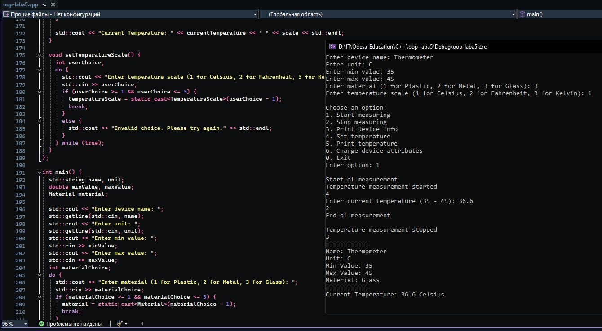

# Лабораторна робота 5. Спадкування

Спадкування передбачає створення класу/класів, які використовують усі атрибути і методи батьківського класу, але відрізняються від нього новими методами, часто і новими атрибутами.

Під час виконання цієї лабораторної роботи клас, який створено як результат лабораторної роботи 2, розглядаємо як батьківський клас. На його основі створено породжений клас, який є більш спеціалізованим за рахунок уведення нових атрибутів і методів.

Під час демонстрації роботи з об'єктами батьківського і породженого класів необхідно показати застосування успадкованих методів і нових методів породженого класу.

Результати тестування програми:

